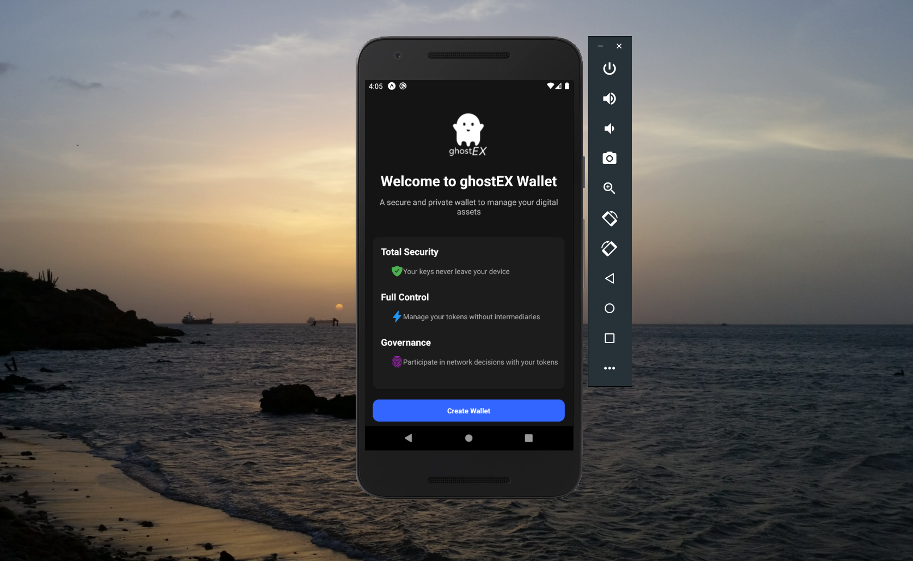

# ghostEX Wallet

A secure and private wallet for your digital assets.

**ghostEX Wallet** is a mobile application that provides a secure, private, and user-friendly way to manage your digital assets. With built-in governance features, total security, and full control over your assets, **ghostEX** gives you everything you need in a modern crypto wallet.

---

## Features

### Total Security

- Your keys never leave your device
- Optional biometric authentication
- Secure encryption for all sensitive data
- No third-party access to your wallet information

### Full Control

- Manage your tokens without intermediaries
- Clear overview of all your assets
- Track token values and portfolio performance
- Simple and intuitive interface for all operations

### Governance

- Participate in network decisions with your tokens
- View and vote on active proposals
- Create new proposals for the community
- Track voting history and proposal outcomes

---

## Getting Started

### Download

Download the latest version of **ghostEX Wallet APK** from our official website: [ghostx.tech](https://ghostx.tech)

### Installation

1. Enable "Install from Unknown Sources" in your Android settings.
2. Open the downloaded APK file.
3. Follow the installation instructions.

### Creating Your Wallet

1. Launch the app.
2. Tap **"Create Wallet"**.
3. Follow the wallet creation process.
4. Securely store your recovery information.
5. Optionally enable biometric authentication for enhanced security.

---

## Usage Guide

### Managing Assets

- **View your total balance** on the Dashboard.
- **Check individual token details** by tapping on any asset.
- **Receive tokens** by sharing your public address.
- **Send tokens** using the transfer feature.

### Participating in Governance

- Browse active proposals in the **Governance tab**.
- View detailed information about any proposal.
- Cast your vote (**For/Against**) on active proposals.
- Create new proposals if you meet the token requirements.

### Security Settings

- Manage biometric authentication.
- Update your wallet password.
- View session history.
- Configure privacy preferences.

---

## Privacy & Security

**ghostEX Wallet** prioritizes your privacy and security:

- No collection of personal data.
- All sensitive information is encrypted locally.
- Private keys never leave your device.
- No tracking or profiling of your activity.
- Optional analytics can be disabled at any time.

---

## In Action

---

## Support

For support, questions, or feedback, please contact:

- **Email**: [support@ghostx.tech](mailto:support@ghostx.tech)
- **Twitter**: [@ghostEX_____](https://twitter.com/ghostEX_____)

---

## Disclaimer

While we strive to ensure maximum security, please practice good security habits and **never share your recovery phrase or private keys with anyone**.
